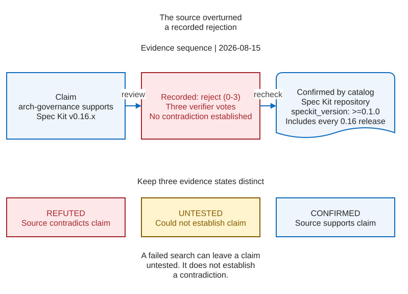

# Case study: A claim three verifiers refuted, and the source confirms

<a id="tldrbluf"></a>

On 2026-08-15, a research pass asked three verifiers to disprove each of 23 claims. It rejected 13,
including one stated verbatim in a primary source it was already reading.

A false claim may fail when someone uses it. A true claim rejected in review may never get another
check. This case concerns work sent to multiple verifiers.

Give verifiers a separate "could not establish" verdict. [Separate refuted from could-not-establish](#separate-refuted-from-could-not-establish) shows the schema change.

---

## What happened

The pass checked claims about `spec-kit-arch-governance`, a third-party extension. One claim said it
was compatible with Spec Kit v0.16.x.

All three verifiers voted to reject it. The pass recorded `0-3`: no votes for the claim and three
against.

The extension's catalog entry in the Spec Kit repository reads:

```json
"arch-governance": { "version": "1.2.2", "author": "Ash Brener",
                     "requires": { "speckit_version": ">=0.1.0" } }
```

`>=0.1.0` includes every 0.16 release. The repository's machine-readable catalog explicitly
supported the claim.

<a id="g14"></a>
<figure class="explain-figure">
  <picture>
    <source media="(max-width: 1100px)" srcset="assets/diagrams/g14-evidence-sequence-mobile.svg">
    
  </picture>
  <figcaption>The recorded rejection and the source evidence supported different conclusions. The catalog confirmed compatibility; a failed search alone would leave the claim untested. Only contradictory evidence refutes it. <a href="assets/diagrams/g14-evidence-sequence.drawio">Editable diagram</a>.</figcaption>
</figure>

---

## Why this kind of error survives review

The pass reported 13 rejections out of 23, which looked like evidence of thorough checking. Nobody
checked the rejected claims again.

The errors draw different kinds of attention:

| | A false positive | A false negative |
|---|---|---|
| How it presents | A claim someone acts on | A claim quietly dropped |
| Who notices | Whoever the claim fails for | Nobody |
| What it looks like | A mistake | Diligence |

A surviving false claim can fail in use. A rejected true claim may quietly disappear.

---

## The mechanism, and it is in the recommended pattern

The adversarial verification prompt often includes this default:

```
Try to refute this finding. Default to refuted=true if you cannot find solid support.
```

This default treats a search that found no support as proof of falsehood. The search may have failed
without testing the claim.

These four cases all return `refuted: true`, although only the last refutes the claim:

- it could not reach the source
- it hit a rate limit
- it searched badly and found nothing
- it read the source, and the source contradicted the claim

The boolean merges a source contradiction with failures to find or reach a source.

[`HS-9`](HOUSE-STYLE.md) applies to this research workflow too: an undetermined result must say so. For the same
reason, `bin/ccx-doctor.ps1` returns exit 2 when it skips a check.

---

## Separate refuted from could-not-establish

Let the verdict distinguish a failed search from evidence against a claim. A boolean cannot express
both.

Three verification workflows run on 2026-08-15 used this schema:

```js
const VERDICT = {
  type: 'object',
  required: ['refuted', 'why'],
  properties: { refuted: { type: 'boolean' }, why: { type: 'string' } },
}
```

A verifier had no field for an unreachable source. The workflow therefore recorded those cases as
rejected claims.

The evidence-gathering phase already used a three-valued enum with `NO_SOURCE_ADDRESSES_IT`. The
verdict phase discarded that distinction.

Use a three-valued enum when judging the evidence too:

```js
verdict: { type: 'string', enum: ['REFUTED', 'SURVIVED', 'COULD_NOT_ESTABLISH'] }
```

Count only `REFUTED` as a rejection. Report `COULD_NOT_ESTABLISH` separately from both rejected and
surviving claims.

The bundled `/deep-research` workflow already reports rate limits and API errors as unverified. It
still needs to distinguish a successful search that found nothing.

---

## What to do with a kill list you already have

Find the wrong kills in a list you have already filed, without rerunning the pass.

Do not treat a boolean rejection list as established fact. This includes every such pass run by this
repository.

Three checks, in descending order of yield:

- Re-read the primary source for any kill that would change a decision. The wrong kill here was
  a semver range in a JSON file, which takes seconds to check and was never checked because the
  vote looked decisive.
- Distrust unanimous kills on mechanical claims most. A `0-3` on a file path, a version pin or a
  command inventory means three verifiers failed to find something checkable. That is more often a
  retrieval failure than a fact.
- Trust kills on judgment claims more. In the same pass, everything mechanically checkable
  survived and everything about promotion criteria and conventions died. That split is credible:
  those claims were killed because nobody has published them, not because a verifier could not
  reach a file.

Expect a mechanical kill to be the cheapest to recheck, and expect some of them to come back.
Auditing the kill below took one read of a README, and that verdict held.

---

## A second kill, audited, and it failed a different way

The same pass killed `0-3`: *"adrkit keeps ADRs in `docs/adr/NNNN-title.md` with a status lifecycle
and supersession-cycle linting."* Read against that tool's own README on 2026-08-15:

| Conjunct | What the source says |
|---|---|
| Defaults to `docs/adr` | True. `ADRKIT_DIR` defaults to `docs/adr` |
| Names files `NNNN-title.md` | Unstated. No naming convention documented |
| Status lifecycle, supersession linting | Not described anywhere |

The rejection was defensible, but it also discarded a true fact. A single verdict cannot preserve
the supported parts of a compound claim.

Split compound claims into separate assertions before checking them. A verifier can then reject an
unsupported part and retain a confirmed one.

Both failures came from asking for a verdict too narrow to express the evidence. In each case,
uncertainty caused the workflow to discard a claim.

---

## The narrower lesson

The pass still rejected 12 claims that deserved rejection. Checking improved the material that
survived.

Its boolean verdict could not show which rejections came from evidence and which came from the
default. The enum gives that distinction a field.
