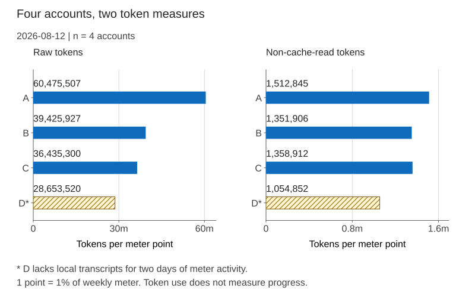

# Token accounting: What a usage meter measures, and what a plan buys

Four accounts measured on 2026-08-12 suggest the weekly meter mostly counts tokens other than cache
reads. Each used the same subscription tier.

Equal meter points represented 21 to 41 USD at published application programming interface (API)
prices. These four samples estimate an undocumented meter; they are not a vendor rate card.

The working estimate is 1.35 million non-cache-read tokens per 1 percent of a weekly window. The
dollar value varies with how often sessions reread cached context.

---

## What was measured

Each Claude Max 20x account cost 200 USD per month. All four ran long coding sessions against one
repository, with large cached contexts.

We summed each account's local session transcripts, using the usage block on every assistant
message. We paired each total with its live weekly percentage at the same moment.

| Account | Weekly meter | Tokens in window | Non-cache-read | Raw per 1 percent | Non-cache-read per 1 percent |
|---|---:|---:|---:|---:|---:|
| A | 92 percent | 5,563,746,679 | 139,181,709 | 60,475,507 | 1,512,845 |
| B | 93 percent | 3,666,611,235 | 125,727,276 | 39,425,927 | 1,351,906 |
| C | 37 percent | 1,348,106,117 | 50,279,736 | 36,435,300 | 1,358,912 |
| D | 97 percent | 2,779,391,470 | 102,320,610 | 28,653,520 | 1,054,852 |

<figure class="explain-figure">
  <picture>
    <source media="(max-width: 1100px)" srcset="assets/charts/g13-token-meter-mobile.svg">
    
  </picture>
  <figcaption>Four accounts measured on 2026-08-12. Non-cache-read tokens vary less per meter point; each panel uses its own labeled scale. Account D lacks local transcripts for two days of meter activity. Token use does not measure progress or promise current prices. <a href="/SCRIPTS.html">Chart builder</a> reads the table above.</figcaption>
</figure>

The weekly windows began two to six days before the reading. Three of the four were near their end,
leaving a short span to extrapolate.

## The meter counts non-cache-read tokens

Raw tokens per 1 percent ranged from 28,653,520 to 60,475,507, a factor of 2.1. Non-cache-read
tokens varied by a factor of 1.4.

B and C agreed within 0.6 percent: 1,351,906 and 1,358,912 non-cache-read tokens per meter point.

The estimate implies a full weekly allowance near 135 million non-cache-read tokens. A month comes
to about 590 million.

Cache reads appear close to free against this meter. The API charges a tenth of fresh input for
them.

At the measured cache ratios of 27 to 40, even that tenth would dominate the bill.

Use the percentage to track allowance use. For progress, count output tokens or completed steps.

- A slow meter can accompany substantial work. A session rereading cached context uses raw tokens about thirty times faster than metered tokens, or forty times in the most cache-heavy account.

## What 200 USD per month buys

We priced each window at the model's published rates per million tokens: 5 USD input, 25 output,
6.25 cache write, and 0.50 cache read.

We scaled each row to a full window, then to a month of 4.348 weeks.

| Account | Raw tokens per month | API list value per month | Multiple on 200 USD |
|---|---:|---:|---:|
| A | 26.3 billion | 17,623 USD | 88x |
| B | 17.1 billion | 12,607 USD | 63x |
| C | 15.8 billion | 11,908 USD | 60x |
| D | 12.5 billion | 9,323 USD | 47x |

B and C give the more defensible comparison: 60x to 63x list value. A and D have known distortions
that readers should not expect to reproduce.

- A's 88x reflects more cache reads. Its raw-to-metered ratio was 40 to 1, against 27 to 29 for the other three accounts. It reread more cached context for each unit of new work.

- D's 47x undercounts use. Its short-window meter showed activity on two days with no local transcripts. Its true value is higher by an unknown amount.

The subscription cost about 0.013 USD per million raw tokens, or 0.35 USD per million non-cache-read
tokens.

The same mix at list price cost roughly 0.75 USD raw and 21 USD non-cache-read. Both comparisons
give about 60x, which cross-checks the result.

## What these numbers are not

| Claim | Limit |
|---|---|
| The metering formula | Unknown. Four observations fitted to the simplest model explaining them |
| The percentages | Integers. At 37 percent the quantisation alone is worth plus or minus 1.4 percent |
| The extrapolation | Assumes the rest of a window resembles the measured part. Row C is a 2.7x extrapolation and is the weakest |
| The dollar figures | A comparison against list price, not a bill. Batch pricing, longer cache lifetimes or a cheaper model all move it |
| The coverage | Local transcripts on one machine only. Row D is the proof that this misses real spend |

Two of the four windows began one to two days before their first token use. Use the window boundary,
not observed activity, to choose the counting period.

## Reproducing it

[USAGE-AWARENESS.md](USAGE-AWARENESS.md) describes the same undocumented client internals. They can change without notice, and this
repository ships no tool for this measurement.

Pair one account's token total with its weekly percentage. Read both for the same account at the
same time.

Read two local sources and take one live reading:

1. Session transcripts. One JSON line per message, carrying a usage block with four counters:
   input, output, cache write and cache read. Subagent transcripts nest under the parent session, so
   a scan that reads only top-level files misses most of the volume.
2. The config root the session ran under. The account is that root's own name, never a field
   inside the per-session record, which carries none
   ([USAGE-AWARENESS.md](USAGE-AWARENESS.md)). Without it every number is a total over an unknown
   mixture of accounts.
3. The live usage endpoint. Supplies the percentage *and the window's reset time*, and must be
   gated on an identity lookup so a reading is provably about the account you think it is.

Work backward from the reset time to find the window's start. Sum only messages at or after that
boundary; a total from the wrong period can still look plausible.

Deduplicate messages by request identifier before summing. Otherwise, retries and streamed messages
can count twice.

Record the token total, weekly percentage, and ratio as one row, using the table above as a model.

## Related

- [USAGE-AWARENESS.md](USAGE-AWARENESS.md) -- reading a percentage safely, and why a threshold alone is not a decision
- [TIPS-AND-TRICKS.md](TIPS-AND-TRICKS.md) -- the general form of an instrument answering a narrower question than the one asked
- [KORUS.md](KORUS.md) -- why the plan, and why more than one account for a week of heavy work
- [DESKTOP-ACCOUNTS.md](DESKTOP-ACCOUNTS.md) -- running several accounts, one desktop instance each
